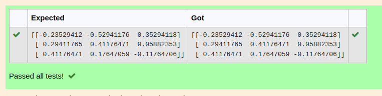

# INVERSE-OF-A-MATRIX
## Aim:
To write a python program to find the inverse of a matrix
## Equipment’s required:
1. 	Hardware – PCs
2. 	Anaconda – Python 3.7 Installation / Moodle-Code Runner
## Algorithm:
Step 1: Import the numpy module to use built-in functions for calculations
Step 2: Prepare the lists from each linear equations andassign in np.array()
### Step 3: Using the np.linalg.solve(), we can find the solutions
### Step 4: End the program

## Program:
```
#Program to find the inverse of the matrix.
#Developed by : SABARI S
#Register no: 22008698
import numpy as np
A=np.array([[1,0,3],[-1,2,-2],[2,3,-1]])
result=np.linalg.inv(A)
print(result)
```

## Output:

## Result:
Thus the inverse of given matrix is successfully solved using python program

